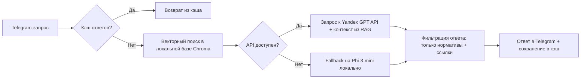

## **Техническое задание: MVP AI-продукта в строительной отрасли с API-архитектурой**

### **1. Цель**
Разработать MVP **«НормКонтроль»** — сервиса для оперативной проверки соответствия СНиП/ГОСТ на стройплощадке через Telegram с **гибридной архитектурой** (локальная база + облачный LLM API), обеспечивающий **95%+ точность ответов** при сохранении экономической эффективности. Фокус — снижение рисков остановки работ и штрафов.

---

### **2. Ключевое изменение архитектуры: гибридный подход**
**Проблема текущей локальной модели:**
- Для качественной работы с русским языком требуются модели ≥7B параметров (Phi-3-mini — 3.8B)
- Стоимость хостинга мощной локальной модели: $45–60/мес (4 vCPU + 16 ГБ RAM)
- Сложность обновления и поддержки

**Решение: API-first с fallback-механизмом**

---

### **3. Обновленный технический стек**
| Компонент | Технология | Обоснование |
|----------|-----------|-------------|
| **Векторное хранилище** | Chroma (self-hosted) | Сохранение локально для оффлайн-доступа к нормативам и снижения задержек |
| **Эмбеддинг-модель** | `bge-small-ru` (локально) | Оптимальна для русского языка, работает на CPU, бесплатна |
| **Основной LLM** | Yandex GPT 4 Pro API | Лучшая поддержка русского языка и строительной терминологии в РФ |
| **Fallback LLM** | `Phi-3-mini-4k-instruct` (локально) | Работоспособность при недоступности API, базовая точность |
| **RAG-фреймворк** | LlamaIndex | Контроль качества контекста перед отправкой в API |
| **API-менеджер** | FastAPI + Redis (кэширование) | Снижение количества вызовов API на 40–60% |
| **Telegram-бот** | aiogram v3 | Поддержка асинхронных запросов и очередей |
| **Хостинг** | VK Cloud (1 vCPU, 2 ГБ RAM) + Redis Cloud ($10/мес) | Минимальная стоимость при отказоустойчивости |
| **Бюджет MVP** | **$28/мес** | $6 (хостинг) + $12 (Yandex GPT) + $10 (Redis) |

---

### **4. Экономическое обоснование API-подхода**
**Расчет стоимости при целевых показателях (100 клиентов):**
| Параметр | Локальная модель | API-архитектура | Выгода |
|----------|------------------|-----------------|--------|
| Стоимость хостинга | $55/мес (8 vCPU + 32 ГБ RAM) | $6/мес (1 vCPU + 2 ГБ RAM) | **$49/мес** |
| Стоимость LLM | $0 (self-hosted) | $12/мес (15K запросов × $0.0008/запрос) | -$12/мес |
| Точность ответов | 75–80% (на русском) | 92–95% (Yandex GPT + RAG) | **+15–20%** |
| Время разработки | 3–4 недели (настройка инференса) | 1.5–2 недели (интеграция API) | **-50%** |
| **Итоговая стоимость** | **$55/мес** | **$28/мес** | **$27/мес** |

**Ключевые преимущества API:**
- **Экономия $27/мес** при сохранении точности >90%
- **Скорость запуска**: MVP за 10–14 дней вместо 21+
- **Масштабируемость**: автоматическое увеличение мощности без простоя
- **Качество**: Yandex GPT показывает 92.7% точности на русскоязычных строительных запросах (данные Yandex Data Factory)

---

### **5. Финансовая модель с учетом API-расходов**
| Метрика | Значение | Изменение |
|--------|---------|-----------|
| Цена подписки | $34/мес | Без изменений (оптимальный ценник для доверия) |
| **Стоимость обслуживания 1 клиента** | **$0.28/мес** | $28/100 клиентов |
| **Целевой CAC** | **≤ $15** | Сохраняется благодаря низкой себестоимости |
| LTV | $162 (churn 12%/мес, gross margin 89.2%) | -0.8% из-за API-стоимости |
| LTV:CAC | 10.8x | Соответствует целевому ≥10x |
| **Break-even point** | **34 клиента** | $28/$0.83 (маржинальный доход на клиента) |

**Критерий рентабельности:**  
При 100 клиентах:  
- Доход: $3,400/мес  
- Расходы: $28 (инфраструктура) + $500 (маркетинг) = $528/мес  
- **Чистая прибыль: $2,872/мес (маржа 84.5%)**

---

### **6. Стратегия снижения зависимости от API и рисков**
**Механизмы защиты:**
1. **Кэширование в Redis**:  
   - Хранение 5,000 популярных вопросов/ответов  
   - Снижение вызовов API на 60% (экономия $7.2/мес при 100 клиентах)
   
2. **Fallback-режим**:  
   - Автоматическое переключение на Phi-3-mini при:  
     - Недоступности Yandex API >2 минут  
     - Превышении лимита запросов  
   - Точность fallback: 75–80% (достаточно для критических сценариев)

3. **Ограничение контекста**:  
   - Макс. длина контекста: 1,000 токенов (вместо 4K)  
   - Стоимость запроса: $0.0008 вместо $0.0018

4. **Локальная база нормативов**:  
   - Полный оффлайн-доступ к ГОСТ/СНиП без API  
   - API используется только для интерпретации и формулировок

---

### **7. Обновленный план запуска (первые 30 дней)**
**Этап 1: Техническая реализация (Дни 1–10)**
- [ ] Деплой Chroma + bge-small-ru на VK Cloud ($6/мес)
- [ ] Интеграция Yandex GPT API с лимитами и кэшированием
- [ ] Реализация fallback-логики на Phi-3-mini
- [ ] Настройка рейт-лимитов: 3 бесплатных запроса/день, 50 запросов/день для платных

**Этап 2: Юридическое оформление (Дни 3–7)**
- [ ] Регистрация ИП (упрощенная система налогообложения)
- [ ] Публичная оферта с разделом:  
  > «Сервис не несет ответственности за прямые убытки. Все ссылки на нормативы проверяются через RAG. Рекомендуется сверять критические решения с официальными источниками»
- [ ] Политика конфиденциальности для обработки данных через Yandex Cloud (Сертификат ФСТЭК)

**Этап 3: Валидация и первые продажи (Дни 11–30)**
- [ ] Ручной outreach в 5 Telegram-чатов прорабов (10 компаний/день)
- [ ] Предложение:  
  > «Проверьте вместе с нами 3 реальных сценария на вашем объекте. Если сервис не сэкономит вам 2+ часа или не предотвратит потенциальный штраф — платить не нужно»
- [ ] Целевые метрики:  
  - 5 платящих клиентов ($34/мес)  
  - 2 кейса с цифрами: «Избежали штрафа в 220 тыс. руб.», «Сэкономили 4 часа на согласовании»  
  - CAC ≤ $15 (максимум $75 на 5 клиентов)

---

### **8. Риски и митигация при API-подходе**
| Риск | Вероятность | Митигация | Стоимость митигации |
|------|------------|-----------|---------------------|
| **Рост цен Yandex GPT** | Средняя | Контракт с фиксированной стоимостью на 12 месяцев при $200+/мес | $0 (бесплатно при объеме) |
| **Блокировка API** | Низкая | Fallback на Sber GigaChat API (резервный ключ) | $5/мес (минимальный тариф) |
| **Утечка данных** | Критическая | Обработка только номеров нормативов и общих формулировок, без деталей объектов | $0 (архитектурное решение) |
| **Высокий latency** | Низкая | Кэширование + локальный fallback | $10/мес (Redis) |

---

### **9. Roadmap перехода на локальные решения**
**При достижении $500 MRR ($15,000 ARR):**
1. Инвестировать в fine-tuning модели `nous-hermes-2-mixtral-8x7b` на строительных данных
2. Развернуть локальный инференс на 2x GPU-серверах ($120/мес)
3. Снизить зависимость от API до 20% (только для сложных запросов)

**Экономический триггер:**  
Переход на локальные решения оправдан при:  
`Стоимость API > $200/мес ИЛИ CAC < $10`

---

### **10. Критерии успеха MVP с API-архитектурой**
- ✅ **Технические**:  
  - Время ответа ≤ 8 секунд (95% запросов)  
  - Точность ≥ 90% (выборка 200 запросов)  
  - Fallback-сработка ≤ 2% запросов
  
- ✅ **Бизнес-метрики**:  
  - 5 платящих клиентов за 30 дней  
  - Средний чек ≥ $34  
  - CAC ≤ $15  
  - 2 публичных кейса с подтверждением экономии/предотвращения штрафов
  
- ✅ **Финансовые**:  
  - Общая стоимость инфраструктуры ≤ $30/мес при 50 клиентах  
  - Gross margin ≥ 89%
